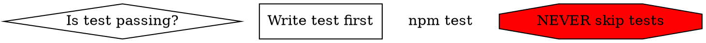

# Skill Forge

Unified skill development toolkit. Combines Anthropic's creation process with quality validation, description optimization, and testing.

## Iron Law

**Skills must be discovered to be useful.** The description is everything.

## When to Use

- **BEFORE** writing any SKILL.md file
- When creating a new skill from scratch
- When improving an existing skill's discovery rate
- When validating skill quality before deployment
- When extracting repeated patterns into codified skills

## When NOT to Use

- One-off instructions (put in CLAUDE.md instead)
- Simple tool usage Claude already knows
- Tasks that don't repeat across sessions

## Quick Start

```bash
# 1. Initialize new skill
scripts/init_skill.py my-skill --path ~/.claude/skills

# 2. Edit SKILL.md (see Workflow below)

# 3. Lint for structure issues
scripts/lint_skill.py ~/.claude/skills/my-skill

# 4. Score description quality (CSO)
scripts/score_description.py ~/.claude/skills/my-skill

# 5. Test with subagent (optional but recommended)
scripts/test_skill.py ~/.claude/skills/my-skill

# 6. Package for distribution
scripts/package_skill.py ~/.claude/skills/my-skill
```

## Workflow: 6-Step Process

### Step 1: Understand with Concrete Examples

**Goal:** Know exactly how the skill will be used before building.

Questions to answer:
- "What would a user say that should trigger this skill?"
- "Can you give examples of how this skill would be used?"
- "What should happen after the skill triggers?"

**Exit criterion:** Clear list of trigger phrases and expected behaviors.

### Step 2: Plan Reusable Contents

Analyze each example to identify:

| Content Type | When to Include | Example |
|--------------|-----------------|---------|
| `scripts/` | Same code rewritten repeatedly | `rotate_pdf.py` |
| `references/` | Documentation Claude should reference | `schema.md` |
| `assets/` | Files used in output (not loaded) | `template.pptx` |

**Exit criterion:** List of scripts/references/assets to create.

### Step 3: Initialize

```bash
scripts/init_skill.py <skill-name> --path <directory>
```

Creates:
- `SKILL.md` with template and TODOs
- `scripts/example.py`
- `references/api_reference.md`
- `assets/example_asset.txt`

Delete unneeded example files.

### Step 4: Edit

**Order matters:**
1. Create scripts/references/assets first
2. Test scripts actually work
3. Write SKILL.md last (it references the resources)

#### SKILL.md Structure

```yaml
---
name: kebab-case-name
description: [See CSO Patterns below]
---
```

**Body sections:**
- Core principle / Iron Law
- When to Use / When NOT to Use
- Workflow with success criteria
- Anti-patterns
- Quick reference
- Integration with other skills

#### CSO Patterns (Critical)

**The description determines discovery.** Follow these patterns:

**Best: MANDATORY gate with BEFORE condition**
```yaml
description: MANDATORY gate before writing any SKILL.md file. Invoke FIRST when building new skills - provides structure, naming, and quality checklist that MUST be validated before deployment.
```

**Good: Specific trigger with method preview**
```yaml
description: Use when encountering any bug, test failure, or unexpected behavior, before proposing fixes - four-phase framework (root cause, pattern analysis, hypothesis testing, implementation) ensures understanding before solutions.
```

**Good: Natural phrase triggers**
```yaml
description: Coach on outcome quality. Triggers on 'check my outcomes', 'is this a good outcome', 'review my Todoist' when discussing strategic work.
```

**Bad patterns to avoid:**
| Pattern | Problem | Fix |
|---------|---------|-----|
| "Helps with..." | Vague, no trigger | Specific phrases in quotes |
| "Use when creating..." | Too generic | "MANDATORY gate before..." |
| No timing condition | Optional invocation | Add BEFORE/FIRST/MANDATORY |

Run `scripts/score_description.py` to validate.

### Step 5: Validate

```bash
# Automated lint (structure, naming, frontmatter)
scripts/lint_skill.py <skill-path>

# CSO score (description quality)
scripts/score_description.py <skill-path>

# Subagent test (discovery + workflow)
scripts/test_skill.py <skill-path>
```

**All checks must pass before Step 6.**

### Step 6: Package (Optional)

```bash
scripts/package_skill.py <skill-path> [output-dir]
```

Creates `.skill` file (zip format) for distribution.

## Quality Checklist

### Structure
- [ ] SKILL.md under 500 lines
- [ ] Name matches directory exactly (kebab-case)
- [ ] Name is gerund/capability form (`systematic-debugging`, not `debug`)
- [ ] Description is third-person ("Orchestrates", not "Use")
- [ ] Description ends with `(user)` tag for user-defined skills
- [ ] References one level deep from SKILL.md
- [ ] YAML frontmatter has name and description only

### Content
- [ ] No time-sensitive information
- [ ] Concrete examples, not abstract rules
- [ ] Configuration values justified
- [ ] Error handling documented
- [ ] Dependencies explicitly listed
- [ ] Anti-patterns section present

### Discovery
- [ ] BEFORE/MANDATORY/FIRST patterns used appropriately
- [ ] Trigger phrases are natural language in quotes
- [ ] Method preview gives Claude enough to decide relevance
- [ ] If paired with command, command names the skill explicitly

## Skill Patterns

### Process Skills (like systematic-debugging)
- Iron law / core principle
- Phases with explicit success criteria
- Anti-patterns with rationalizations
- Red flags that trigger "STOP"
- BEFORE condition in description

### Fluency Skills (like workspace-fluency)
- Tool selection guidance
- Workflows for common tasks
- Best practices for domain
- Error handling patterns

### Coaching Skills (like desired-outcomes)
- Quality criteria with good/poor examples
- Coaching questions to ask
- Pattern recognition for bad input
- Specific trigger phrases

### Gate Skills (like this one)
- MANDATORY language in description
- Checklist-driven validation
- Requirements with examples
- Complement process skills

### Skill+CLI Pattern (Most Powerful)

When skill orchestrates a CLI tool:

```markdown
# {skill-name}

Orchestrates {domain} using `{cli}` command.

## CLI Reference
- `{cli} command1` - Description
- `{cli} command2` - Description

## Workflows
### Common Task
\`\`\`bash
{cli} step1
{cli} step2
\`\`\`

## When Skill Extends CLI
- Coaching questions
- Quality criteria
- Integration with other skills

## Error Recovery
| Error | Cause | Fix |
```

See `references/skill-cli-pattern.md` for full template.

## DOT Graphs for Workflows

For complex decision trees, embed DOT graphs:



Run `scripts/render_graphs.py <skill-path>` to render SVG.

**Node shapes:**
- `diamond` - decisions/questions
- `box` - actions (default)
- `plaintext` - literal commands
- `ellipse` - states
- `octagon` (red) - STOP/warnings
- `doublecircle` - entry/exit points

## Anti-Patterns

### Discovery Failures

| Anti-Pattern | Symptom | Fix |
|--------------|---------|-----|
| "Use when creating..." | Claude bypasses skill | "MANDATORY gate before..." |
| "Helps with..." | Never invoked | Specific trigger phrases |
| No timing gate | Optional invocation | Add BEFORE/FIRST |
| Generic actions | Claude "knows" without loading | Domain-specific phrases |

### Structure Failures

| Anti-Pattern | Symptom | Fix |
|--------------|---------|-----|
| SKILL.md > 500 lines | Token bloat | Split into references/ |
| Name doesn't match dir | Skill not found | Keep synchronized |
| Deeply nested refs | Discovery fails | One level deep max |

### Content Failures

| Anti-Pattern | Symptom | Fix |
|--------------|---------|-----|
| Explaining known things | Wastes tokens | Domain-specific only |
| Magic constants | Unclear reasoning | Justify all values |
| Many options, no default | Analysis paralysis | Recommend one path |

## Integration

**Uses scripts from skill-creator (Anthropic):**
- `init_skill.py` - Generate template
- `package_skill.py` - Create .skill file

**New scripts (this skill):**
- `lint_skill.py` - Automated structure validation
- `score_description.py` - CSO quality scoring
- `test_skill.py` - Subagent pressure testing
- `render_graphs.py` - DOT to SVG

## Before Sharing

Run the sharing scanner:

```bash
scripts/scan.py <skill-path>
scripts/scan.py --risk high <skill-path>  # High-risk only
```

Detects: emails, paths with usernames, secrets, company terms.

See `references/sharing-scan.md` for triage guidelines.

## References

- `references/cso-guide.md` - Claude Search Optimization principles
- `references/skill-cli-pattern.md` - Skill+CLI template
- `references/skill-patterns.md` - Pattern taxonomy
- `references/rationalization-table.md` - Common excuses to block

## Success Criteria

This skill works when:
- Every skill built passes lint + CSO score > 70
- Description triggers invocation reliably
- Subagent tests discover and follow workflow
- Anti-patterns caught before deployment

**The test:** If Claude "knows" patterns without invoking the skill, the description failed.
